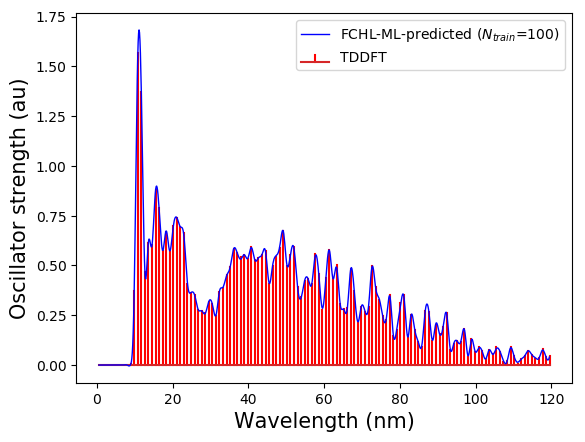

Train an FCHL-KRR machine with 100 examples from the bigQM7w dataset (UFF geometries and wB97XD/def2SVPD TDDFT spectra) and predict the electronic spectrum of a query molecule

To run this example, install `qmlspectrum` via `pip3 install qmlspectrum` and the dependencies

Run

```
  python3 inp.py
```

This example will take a few minutes to complete and will generate four files

* FCHL_UFF.npy
* def2SVP_spec_128bins.npy
* shuffle_index.dat
* Kernel_00100.dat.npy

Note that `.npy` files are in binary format created by `numpy`. These files can be reused in a separate calculation by setting the following 4 variables to be `True` in `inp.py`  

```
read_X=False         
read_P=False         
load_indices = False
load_K = False
```

In the input script, `iquery=0` indicates that we want to predict the spectrum of the first molecule after shuffling. This molecule is a part of the trainingset, so we will be able to predict its spectrum very well as can be seen by the output spectrum shown below.



If you want to try another example for query, you can check the _absolute_ indices of the bigQM7w molecules in the file `shuffle_index.dat`


