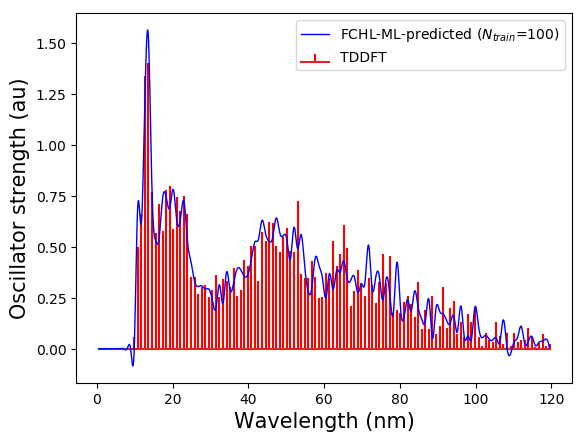

Reload data from `test_001` and predict the spectrum of a molecule from the training set and a new query molecule, not part of the training.

Run

```
  python3 inp.py
```

copy the following four files from `../test_001`

* FCHL_UFF.npy
* def2SVP_spec_128bins.npy
* shuffle_index.dat
* Kernel_00100.dat.npy

Set the following 4 variables to be `True` in `inp.py`

```
read_X = True
read_P = True
load_indices = True
load_K = True
```




